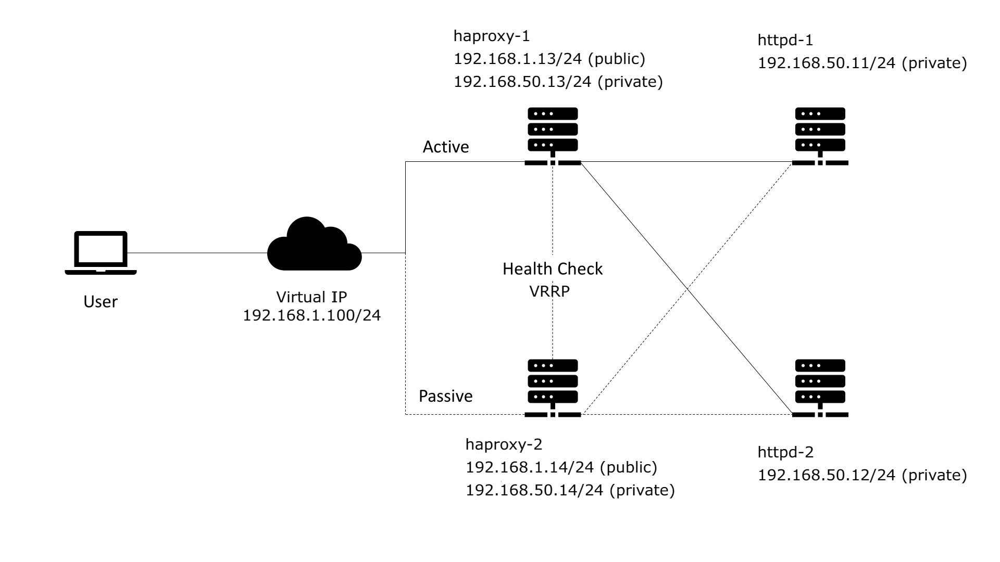

# High Availability and Load Balancing with HAProxy and Keepalived


## Overview

This is a highly available load balancer stack.
The stack is made up of 4 servers:

Two of the servers, **haproxy-1** and **haproxy-2** will be the load balancers and we will be using **HAProxy** for load balancing and **Keepalived** for high availability. These load balancers will be configured identically and will be setup in a master/backup mode.

The active load balancer **haproxy-1** will route traffic to web servers **httpd-1** and **httpd-2** in round robin mode. When the active load balancer crashes, the load balancer fails over to the passive node **haproxy-2** which routes traffic to the web servers.

**HAProxy** is a free, very fast and reliable solution offering high availability, load balancing, and proxying for TCP and HTTP-based applications. In this stack, it serves as a simple HTTP load balancer and listens on the virtual IP that is allocated by Keepalived.

**Keepalived** is used for high availability so if one primary server stops working, the load balancer fails over to the backup or secondary server.

Keepalived allocates a virtual IP from the same network and binds it to master server. When a failover happens,
Keepalived removes the virtual IP from the server's configuration and enables it on the backup server that is currently chosen to route traffic.

The other two servers will the web servers with **apache http server** and to see the load balancing in action,
they will serve their private IPs and hostnames.

httpd-1
```
192.168.50.11 httpd-1.lab.example.com
```

httpd-2
```
192.168.50.12 httpd-2.lab.example.com
```

All components are automatically installed with via Vagrant.


## Architecture




## Requirements
- Vagrant
- VirtualBox

Vagrant will lease IPs from your host's network to **haproxy-1** and **haproxy-2** nodes.
The virtual IP is also allocated from the same network.

Ensure that IP addresses below fits your host's network.
If your host network is 192.168.1.0/24 you don't need to change.

Vagrantfile
```
HAPROXY1_PUBLIC = "192.168.1.13"
HAPROXY2_PUBLIC = "192.168.1.14"
```

globals.sh
```
export HAPROXY1_PUB="192.168.1.13"
export HAPROXY2_PUB="192.168.1.14"
```

## Install

```bash
vagrant up
```

**Warning:** centos/7 boxes upgraded before installing software packages. So it might take a long time.

## Connect and become root

Open 2 terminals on your host and connect haproxy-1 and haproxy-2

```bash
# From first terminal
vagrant ssh haproxy-1
sudo -i

# From second terminal
vagrant ssh haproxy-2
sudo -i
```

## Test Keepalived

### In haproxy-1

Get the virtual IP
```bash
echo $VIRTUAL_IP_ADDRESS

# Try to access from your host's browser to http://$VIRTUAL_IP_ADDRESS
```

Ensure the virtual IP is assigned to eth1 interface
```bash
ip a s eth1
```

## Monitor Keepalived advertisement messages

### In haproxy-1

```bash
tcpdump -c 4 -ni eth1 vrrp
```

### In haproxy-2
```bash
tcpdump -c 4 -ni eth1 vrrp
```

Both tcpdump outputs must be something like below. (192.168.1.13 > 192.168.1.14)

Master node sends advertisement messages to backup node.

Keepalived nodes send messages over **VRRP** protocol.

If the backup node can't get advertisements, it becomes new master and takes over the virtual IP.

```
tcpdump: verbose output suppressed, use -v or -vv for full protocol decode
listening on eth1, link-type EN10MB (Ethernet), capture size 262144 bytes
03:00:13.136071 IP 192.168.1.13 > 192.168.1.14: VRRPv2, Advertisement, vrid 51, prio 103, authtype simple, intvl 2s, length 20
03:00:15.138068 IP 192.168.1.13 > 192.168.1.14: VRRPv2, Advertisement, vrid 51, prio 103, authtype simple, intvl 2s, length 20
03:00:17.139998 IP 192.168.1.13 > 192.168.1.14: VRRPv2, Advertisement, vrid 51, prio 103, authtype simple, intvl 2s, length 20
03:00:19.141511 IP 192.168.1.13 > 192.168.1.14: VRRPv2, Advertisement, vrid 51, prio 103, authtype simple, intvl 2s, length 20
```

## Trigger failover

### In haproxy-1

Stop the **httpd** service.

When Keepalived health check for **httpd** service fails, It will stop sending advertisements to backup node.

Then backup node will take over the virtual IP.

```bash
systemctl stop httpd
```

Repeat the testing steps above and ensure that virtual IP is assigned to eth1 on **haproxy-2**

Try to access virtual IP from your host's browser again.

You should still be able to access to load balancer.


## Clean up

### Run from your host machine

```bash
vagrant destroy
```

## Resources
- https://www.redhat.com/sysadmin/keepalived-basics

- https://access.redhat.com/documentation/en-us/red_hat_enterprise_linux/7/html/load_balancer_administration/index

- https://docs.oracle.com/en/operating-systems/oracle-linux/8/balancing/balance-combo.html
